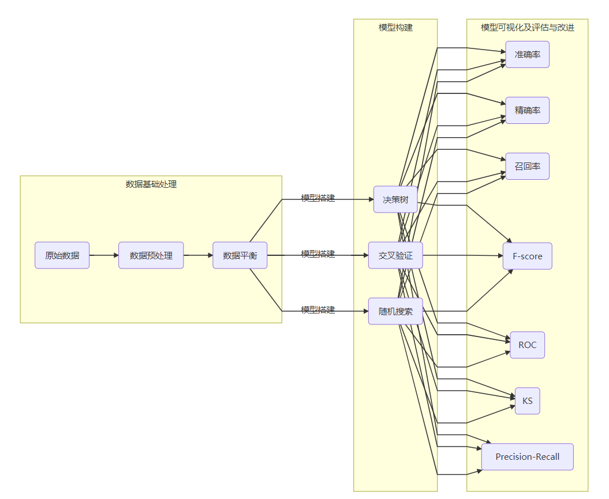
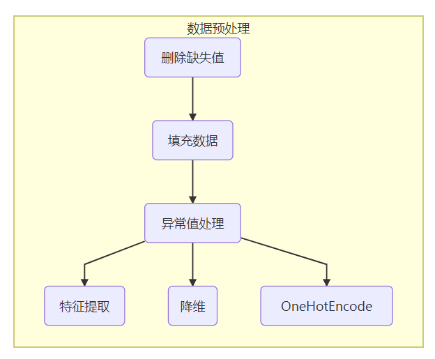

Machine Learning With Python For TeamWork





# 任务清单

## 1、数据预处理方法

### 1.1 删除列缺失值较多的数据（自定义CutOff）

```python
  def deleteTheCol(cutoff,inputfile,outputfile):
      return True
  #c传入输入文件，输出文件路径；cutoff为自定义删除缺失为(1-(cutoff*100))%的列
```

- [x] 已实现

### 1.2 删除行缺失值较多的数据（程序生成CSV，手动格式删除）[可选]

```python
  def deleteTheRow(file,outfile):
      return True
  #传入输入文件，输出文件路径；会生成比原先数据多一列的数据，值越大表明缺失的数据越少
```

- [x] 已实现

### 1.3 缺失值填充（SimpleImputer{或者插值法或者均值/中位数/众数插补}+填充0值）

本项目采取mean值填充，若想修改方法去QuickInit中的FillNaN_PD修改

```python
  def FillNaN_PD(inputfile):#不带标签的Pandas，自行补充
      return DataFrame
  #传入输入文件，返回不带标签的DataFrame类型数据
  '''
  若想添加标签
  pd_Example=pd.read_csv(inputfile)
  feature = list(pd_Example.columns.values)  # 提取特征值
  pd_Example.columns = feature
  '''
```

 ```python
  def FillNaN_NP(inputfile3):#不带标签的Numpy,自行补充
      return series
  #Same as FillNaN_PD
 ```

- [x] 已实现

### 1.4 异常值处理（删除/平均值修正)

- [ ] 异常值处理

  - 简单统计

  - 3∂原则

  - 箱型图

  - 基于模型检验

  - 基于近邻度的离群点检测

  - .....

    检测到了异常值，我们需要对其进行一定的处理。而一般异常值的处理方法可大致分为以下几种：

    - **删除含有异常值的记录**：直接将含有异常值的记录删除；
    - **视为缺失值**：将异常值视为缺失值，利用缺失值处理的方法进行处理；
    - **平均值修正**：可用前后两个观测值的平均值修正该异常值；
    - **不处理**：直接在具有异常值的数据集上进行数据挖掘；

### 1.4 one hot encode编码定义

- [x] 没写在QuickInit里；写在了HandleTheQuestion里

  ```python
  from sklearn.preprocessing import OneHotEncoder
  ....
  ```

### 1.5 降维、特征提取

- [x] 主成分分析 PCA

  ```python
  def PCA_EXAMPLE(inputfile,k):#返回Numpy，k等于你想降到多少维度
      return x_trainPCA
  # 会输出系数
  #包括主成分的热图
  ```

  

### *1.6 LASSO

```python
  from sklearn.linear_model import Lasso,LassoCV,LassoLarsCV
  data.corr()
  ....
```
- [ ] 未应用，已实现

## 2、解决非平衡数据问题

### 2.1 SMOTE算法

- [x] SMOTE，也可自己手动划分数据集

  ```python
  def CutTheTrain(inputfile,p):#手动切割训练集及测试集、p=训练集的比例：0~1
       return train,test
  '''
  返回两个numpy
  train，test
  '''
  ```

```python
def SMOTE_SAMPLE(inputfile):#返回Numpy
    return over_samples_X,over_samples_y
'''
testsize和random_state自己设置
random自己设置
'''
```

## 3、决策树

### 调参gini或者entropy 树深节点数 

（正在整理调包参数）

| 参数                                             | DecisionTreeClassifier                                       |
| :----------------------------------------------- | :----------------------------------------------------------- |
| 特征选择标准criterion                            | 可以使用"gini"或者"entropy"，前者代表基尼系数，后者代表信息增益。一般说使用默认的基尼系数"gini"就可以了，即CART算法。除非你更喜欢类似ID3, C4.5的最优特征选择方法。 |
| 特征划分点选择标准splitter                       | 可以使用"best"或者"random"。前者在特征的所有划分点中找出最优的划分点。后者是随机的在部分划分点中找局部最优的划分点。默认的"best"适合样本量不大的时候，而如果样本数据量非常大，此时决策树构建推荐"random" |
| 划分时考虑的最大特征数max_features               | 可以使用很多种类型的值，默认是"None",意味着划分时考虑所有的特征数；如果是"log2"意味着划分时最多考虑log2N个特征；如果是"sqrt"或者"auto"意味着划分时最多考虑N−−√N个特征。如果是整数，代表考虑的特征绝对数。如果是浮点数，代表考虑特征百分比，即考虑（百分比xN）取整后的特征数。其中N为样本总特征数。  一般来说，如果样本特征数不多，比如小于50，我们用默认的"None"就可以了，如果特征数非常多，我们可以灵活使用刚才描述的其他取值来控制划分时考虑的最大特征数，以控制决策树的生成时间。 |
| 决策树最大深度max_depth                          | 决策树的最大深度，默认可以不输入，如果不输入的话，决策树在建立子树的时候不会限制子树的深度。一般来说，数据少或者特征少的时候可以不管这个值。如果模型样本量多，特征也多的情况下，推荐限制这个最大深度，具体的取值取决于数据的分布。常用的可以取值10-100之间。 |
| 内部节点再划分所需最小样本数min_samples_split    | 这个值限制了子树继续划分的条件，如果某节点的样本数少于min_samples_split，则不会继续再尝试选择最优特征来进行划分， 默认是2，如果样本量不大，不需要管这个值。如果样本量数量级非常大，则推荐增大这个值。10万样本，建立决策树时，min_samples_split=10，可以作为参考。 |
| 叶子节点最少样本数min_samples_leaf               | 这个值限制了叶子节点最少的样本数，如果某叶子节点数目小于样本数，则会和兄弟节点一起被剪枝。 默认是1,可以输入最少的样本数的整数，或者最少样本数占样本总数的百分比。如果样本量不大，不需要管这个值。如果样本量数量级非常大，则推荐增大这个值。之前的10万样本项目使用min_samples_leaf的值为5，仅供参考。 |
| 叶子节点最小的样本权重和min_weight_fraction_leaf | 这个值限制了叶子节点所有样本权重和的最小值，如果小于这个值，则会和兄弟节点一起被剪枝。 默认是0，就是不考虑权重问题。一般来说，如果我们有较多样本有缺失值，或者分类树样本的分布类别偏差很大，就会引入样本权重，这时我们就要注意这个值了。 |
| 最大叶子节点数max_leaf_nodes                     | 通过限制最大叶子节点数，可以防止过拟合，默认是"None”，即不限制最大的叶子节点数。如果加了限制，算法会建立在最大叶子节点数内最优的决策树。如果特征不多，可以不考虑这个值，但是如果特征分成多的话，可以加以限制，具体的值可以通过交叉验证得到。 |
| 类别权重class_weight                             | 指定样本各类别的的权重，主要是为了防止训练集某些类别的样本过多，导致训练的决策树过于偏向这些类别。这里可以自己指定各个样本的权重，或者用“balanced”，如果使用“balanced”，则算法会自己计算权重，样本量少的类别所对应的样本权重会高。当然，如果你的样本类别分布没有明显的偏倚，则可以不管这个参数，选择默认的"None" |
| 节点划分最小不纯度min_impurity_split             | 这个值限制了决策树的增长，如果某节点的不纯度(基尼系数，信息增益，均方差，绝对差)小于这个阈值，则该节点不再生成子节点。即为叶子节点 。 |
| 数据是否预排序presort                            | 这个值是布尔值，默认是False不排序。一般来说，如果样本量少或者限制了一个深度很小的决策树，设置为true可以让划分点选择更加快，决策树建立的更加快。如果样本量太大的话，反而没有什么好处。问题是样本量少的时候，我速度本来就不慢。所以这个值一般懒得理它就可以了。 |

- [ ] 还没实现

## 4、交叉验证+网格搜索+随机搜索

- [ ] 还没实现

## 5、准确率+精确率+召回率F-score 给出分析

- [ ] 还没实现

## 6、ROC+KS+Precision-Recall

- [ ] 还没实现